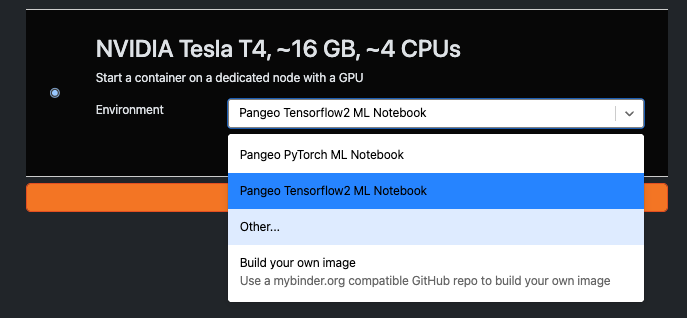

# Curated Docker image for the NMFS Openscapes hackhour

This repository contains a curated Docker container for trying out CuPy-Xarray on a JupyterHub.

## Getting started

1. Navigate to [https://nmfs-openscapes.2i2c.cloud/hub/spawn](https://nmfs-openscapes.2i2c.cloud/hub/spawn)
2. Navigate to the lower entry for "NVIDIA Tesla T4" and scroll down to "Other.."
   
3. Enter `quay.io/maxrjones/openscapes-nmfs-gpu:dcee3a318895` in the text box
4. Click start
5. When the server spawns, download the cupy-xarray repository using `git clone https://github.com/xarray-contrib/cupy-xarray.git`
